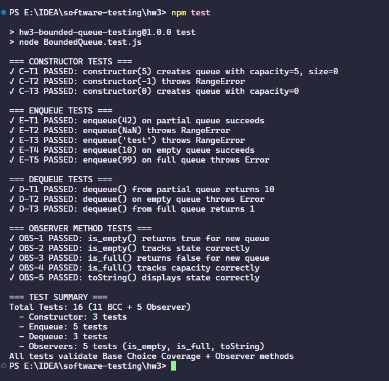
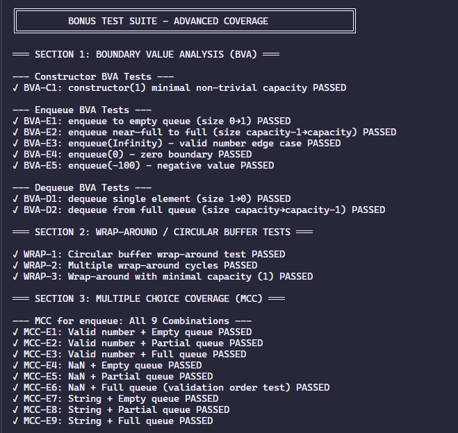
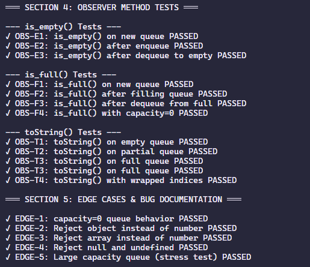

# HW3: Input Space Partitioning for BoundedQueue

## Quick Start

```bash
# Run core BCC test suite
npm test

# Run bonus test suite (BVA, MCC, wrap-around, observers)
npm run test:bonus

# Run all tests
npm run test:all

# Run demo
npm run demo
```

## Test Results

### Core BCC Test Suite


### Bonus Test Suite Results




---

## Deliverables

### Core Requirements
- **`ISP_Analysis.md`** - Complete ISP breakdown (steps a-e) for constructor, enqueue, dequeue
- **`BoundedQueue.test.js`** - 16 test cases: 11 BCC + 5 observer tests (all passing ✓)
- **`HW3_Report.md`** - Comprehensive analysis report with bonus sections

### Bonus Work
- **`BVA_Analysis.md`** - Boundary Value Analysis with 8 additional tests
- **`MCC_Analysis.md`** - Multiple Choice Coverage analysis and BCC comparison
- **`Bonus_Tests.js`** - 35 advanced tests (wrap-around, observers, edge cases)

### Source Files
- **`BoundedQueue.js`** - Implementation with demo code
- **`package.json`** - Project configuration with test scripts

## Test Coverage

### Core Test Suite (16 tests)

| Method | Tests | Coverage |
|--------|-------|----------|
| constructor | 3 | All blocks (negative, zero, positive capacity) |
| enqueue | 5 | Element validity × Queue state combinations |
| dequeue | 3 | All queue states (empty, partial, full) |
| **observers** | **5** | **is_empty, is_full, toString (mutator/observer pairs)** |
| **Total** | **16** | **BCC + Observer methods** |

### Bonus Tests (35 tests)

| Category | Tests | Coverage |
|----------|-------|----------|
| Boundary Value Analysis | 8 | capacity=1, state transitions, numeric edges |
| Wrap-Around/Circular Buffer | 3 | Critical circular buffer logic validation |
| Multiple Choice Coverage | 9 | All element × state combinations |
| Observer Methods (extended) | 10 | toString edge cases, capacity=0, wrap-around display |
| Edge Cases | 5 | null, objects, arrays, large capacity |
| **Total** | **35** | **Advanced coverage techniques** |

### Combined: 51 Total Tests ✓

## Structure

```
hw3/
├── ISP_Analysis.md          # Detailed ISP process (core requirement)
├── BVA_Analysis.md          # Boundary Value Analysis (bonus)
├── MCC_Analysis.md          # Multiple Choice Coverage (bonus)
├── HW3_Report.md            # Comprehensive submission report
├── BoundedQueue.test.js     # Core test suite (16 tests: 11 BCC + 5 observer)
├── Bonus_Tests.js           # Advanced test suite (35 tests)
├── BoundedQueue.js          # Implementation with demo
├── package.json             # Project config with test scripts
├── README.md                # This file
└── docs/
    ├── Input Space Partitioning for BoundedQueue.md
    └── require.png
```

## Key Features

### Core BCC Work
- ✅ Complete ISP methodology (steps a-e) for 3 methods
- ✅ 16 tests: 11 BCC + 5 observer methods (mutator/observer pairs)
- ✅ Native Node.js assertions (no external dependencies)
- ✅ 100% pass rate with comprehensive oracles

### Bonus Advanced Coverage
- ✅ **Wrap-around testing** - Critical circular buffer validation
- ✅ **BVA** - 8 boundary tests (capacity=1, state transitions, numeric edges)
- ✅ **MCC** - 9 combinatorial tests with validation order analysis
- ✅ **Observer methods (extended)** - 10 additional tests in bonus suite
- ✅ **Edge cases** - null, undefined, objects, arrays, large capacity
- ✅ **Comprehensive documentation** - 3 analysis documents + detailed report

## Highlights

- **51 total tests** (16 core + 35 bonus) with 100% pass rate
- **Critical finding**: Element validation precedes state checks (MCC insight)
- **Wrap-around coverage**: Most valuable addition beyond BCC
- **capacity=0 analysis**: Edge case behavior documented
- **Academic rigor**: BCC vs MCC trade-off analysis included
- **Complete AI transparency**: Detailed interaction logs in appendix
